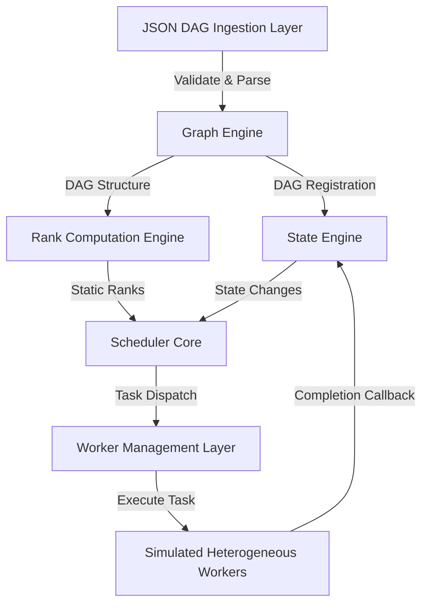
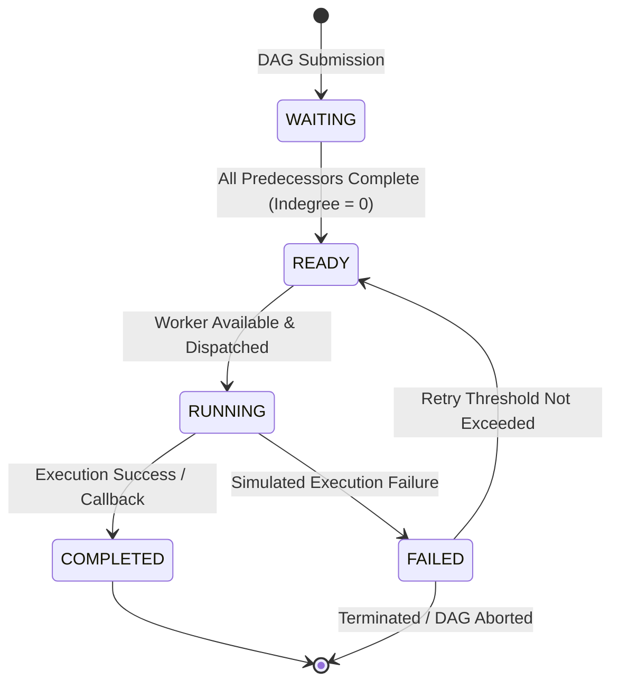
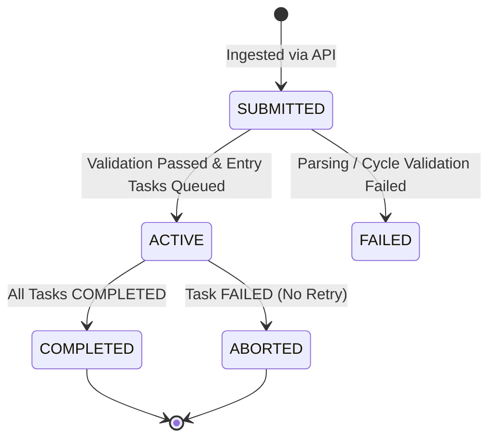
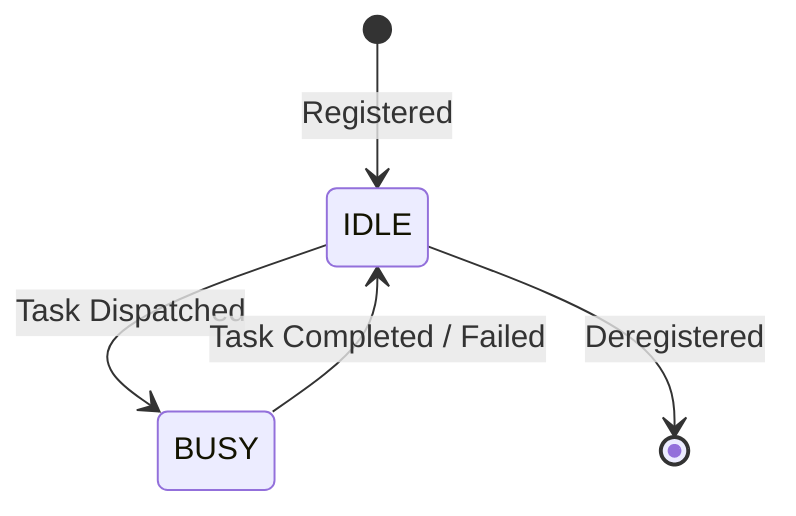

# DPLS Runtime Engine: Architecture & Systems Implementation Blueprint

This document specifies the technical architecture and systems design for the DPLS (Dynamic Priority List Scheduling) runtime engine. It serves as an implementation blueprint for a single-machine, concurrency-safe, event-driven DAG execution runtime implemented in pure Go.

---

## 1. High-Level Runtime Architecture

The DPLS runtime is an event-driven scheduler that manages the execution of multiple independent Directed Acyclic Graphs (DAGs) on a set of heterogeneous workers. Unlike static simulators, the DPLS runtime acts as a continuous operating loop that handles online DAG arrival, tracks dependency states, dynamically calculates execution priorities, and schedules tasks onto workers based on current resource availability.

### 1.1 Structural Decomposition

The system is decomposed into five primary layers:



1. **Ingestion & Validation Layer**: Ingests JSON files defining DAG templates, validates cycles, and constructs in-memory representations.
2. **Graph & State Engines**: Maintains the topology and operational state of all active and waiting DAGs and their task nodes.
3. **Rank & Priority Engine**: Recursively calculates upward ($Rank_U$) and downward ($Rank_D$) ranks and computes runtime dynamic priorities using contention metrics.
4. **Scheduler Core & Event Loop**: A centralized, single-threaded execution loop that consumes lifecycle events, manages the global Priority Queue (PQ), and matches tasks to workers.
5. **Worker Execution Manager**: Coordinates simulated heterogeneous workers, tracks resource load, and executes tasks using goroutine timers to simulate computation and communication overhead.

### 1.2 Runtime Event Flow

The system operates as an **event-driven reactor**. The scheduler remains idle or processes events from a centralized event channel:

```
[Online DAG Arrival] ──────┐
                           ▼
[Task Execution Done] ──> [ Central Event Channel ] ──> [ Scheduler Event Loop ]
                           ▲                                   │
[Worker Freed] ────────────┘                                   ▼
                                                       [ Dispatch to Worker ]
```

* **DAG Submission**: Triggers parsing, rank computation, task initialization to `WAITING`, and queueing of entrance nodes (indegree = 0) into the `READY` queue.
* **Task Completion**: Reduces the unresolved dependency count (indegree) of succeeding tasks. Unlocked tasks transition from `WAITING` to `READY` and are pushed onto the Priority Queue.
* **Worker Release**: When a worker finishes a task, it reports back to the scheduler, signaling worker availability and triggering a new scheduling pass.

---

## 2. Cross-Layer Co-Designed Architecture Model

The DPLS runtime is conceptually designed as a **cross-layer co-designed runtime architecture**. Rather than running the scheduling runtime and execution layer as isolated silos, the system coordinates userspace DAG scheduling with kernel-level dataplane execution.

### 2.1 Conceptual Separation of Responsibilities

The system decouples scheduling decisions, communication, metadata state, and network execution:

```
┌────────────────────────────────────────┐
│      DPLS Scheduler (Userspace)        │ <--- DAG Ingestion, Rank Calculation, Dynamic Priority
└──────────────────┬─────────────────────┘
                   │
                   ▼ (Emits Intent Metadata)
┌────────────────────────────────────────┐
│     Control Plane Bridge (Userspace)   │ <--- Syscalls / Netlink / eBPF Map Updates
└──────────────────┬─────────────────────┘
                   │
                   ▼ (Programs Maps)
┌────────────────────────────────────────┐
│         eBPF Maps (Kernel State)       │ <--- Shared metadata state: routing, fan-out, consumer states
└──────────────────┬─────────────────────┘
                   │
                   ▼ (Controls Flow)
┌────────────────────────────────────────┐
│      eBPF Programs (Kernel Dataplane)  │ <--- Active packet interception, sockmap steering
└────────────────────────────────────────┘
```

The roles of each layer are defined as follows:

| Layer | Responsibility |
|---|---|
| **DPLS Scheduler (The Brain)** | Multi-DAG analysis, RankU/RankD computation, dynamic priority calculation, contention-aware scheduling, dependency fan-out analysis, and heterogeneous worker task assignment. |
| **Control Plane Bridge (The Interface)** | Communication bridge transferring userspace scheduler execution decisions into the kernel. It writes routing and state configuration directly into kernel-resident maps. |
| **eBPF Maps (The Vault)** | Shared kernel-resident metadata storage. Holds routing tables, task dependency states, data retention flags, and downstream consumer tracking tables. |
| **eBPF Programs (The Muscle)** | Executes active socket/packet interception, kernel-level socket redirection (`sockmap`/`sk_msg`), dependency-aware forwarding, data payload retention, and direct execution mapping. |

### 2.2 Scheduling Logic vs. Dataplane Execution Logic

To maintain clean abstractions, we enforce a strict separation between **decision logic** and **data routing logic**:

| Concept | Meaning |
|---|---|
| **Scheduling Logic** | Decides **WHAT** task should run, **WHEN** it should run, and **WHERE** (on which worker) it should be dispatched. It works in the time/priority domain. |
| **Control Plane** | Communicates scheduling intent and mapping states from userspace to kernel-space by updating configuration structures and maps. |
| **Kernel State** | Stores dynamic execution routing tables and tracking states (e.g., how many consumers are left for a specific payload). |
| **Data Plane** | Executes actual data redirection, forwarding, payload replication, and memory bypasses in the networking path. |

Under this decoupled model:
$$\text{Scheduler Runtime} \longrightarrow \text{Metadata Emission} \longrightarrow \text{Kernel-State Programming} \longrightarrow \text{Dataplane Execution}$$
The scheduler never directly handles network packets or byte streams. Instead, it programs the kernel's state, turning the Linux networking engine into an execution utility for the DAG.

### 2.3 Dependency Fan-Out & Scheduler-Driven Kernel Intent

A major extension introduced in this architecture beyond the original DPLS paper is the **Dependency Fan-Out Extension**.

#### Dependency Fan-Out ($FanOut(T_i)$)
* **Definition**: The number of downstream successor tasks that require the output payload of a parent task $T_i$.
* **Calculation**:
  $$FanOut(T_i) = |Successors(T_i)|$$
  For example, if Task A is followed by Task B and Task C ($A \to B$ and $A \to C$), then $FanOut(A) = 2$.

#### Relevance to Kernel Dataplane
By computing the fan-out in userspace, the scheduler generates **Scheduler-Driven Kernel Intent**. Instead of treating data routing as generic TCP streams, the scheduler emits directives directly to the kernel-space dataplane:
1. **Payload Retention**: When a task $T_i$ with $FanOut(T_i) = 2$ completes on a worker, the kernel-level dataplane knows not to free the buffer or close the socket connection immediately. It retains the payload in memory until both downstream consumers have consumed it.
2. **Multi-Consumer Forwarding**: The kernel dataplane reads the downstream consumer metadata from the eBPF maps to duplicate and forward the output data directly to multiple workers in parallel, bypassing userspace copying.
3. **Proactive Routing**: The control plane pre-programs routing tables in the kernel before downstream tasks begin execution, enabling near-zero routing setup overhead.

### 2.4 Extensibility Interfaces for Kernel Integration

To prevent coupling and make future kernel integration possible without modifying the core Go scheduler, the runtime exposes clean metadata channels. The scheduler exposes these metadata structures via its runtime engine interfaces:

```go
type KernelIntentEmitter interface {
    EmitTaskIntent(intent TaskIntent) error
    EmitDependencyState(dep StateDependency) error
    EmitWorkerRoute(route WorkerRoute) error
}

type TaskIntent struct {
    TaskID           string
    DAGID            string
    AssignedWorkerID string
    FanOutCount      int32
    DownstreamWorkers []string
}
```

By querying these interfaces, a future control plane bridge (eBPF/XDP/Cilium integration) can subscribe to scheduler outputs and write them directly into:
* **eBPF socket maps (`sockmap` / `sk_msg`)** for socket bypass.
* **Cilium network policy maps** for container networking bypass.
* **Kernel retention tables** for low-latency in-memory packet forwarding.

### 2.5 Architectural Philosophy

The system is not merely **"DPLS + eBPF"**. Rather, it represents a **scheduler-driven programmable dataplane architecture** where application-layer DAG intelligence proactively programs lower-layer execution behavior. 

By co-designing the scheduling logic alongside the execution path, this blueprint bridges the traditional abstraction gaps between:
* DAG scheduling theory (upward/downward ranks, makespan maximization)
* Runtime execution systems (goroutine pools, dynamic priority queues)
* Linux dataplane behavior (socket structures, socket steering)
* Kernel-level packet execution paths (sk_buff manipulation, TC redirection)

---

## 3. Full Internal System Design

### 3.1 DAG Input Layer

The DAG Input Layer ingests and sanitizes external graph definitions.

#### JSON DAG Schema Design
Each DAG is submitted using a JSON payload representing tasks, their execution profile, and network dependencies.
```json
{
  "dag_id": "dag-9821a",
  "arrival_time": 1716682000,
  "tasks": [
    {
      "task_id": "task-0",
      "base_computation": 120,
      "successors": [
        { "task_id": "task-1", "data_size": 450 },
        { "task_id": "task-2", "data_size": 800 }
      ]
    },
    {
      "task_id": "task-1",
      "base_computation": 85,
      "successors": [
        { "task_id": "task-3", "data_size": 300 }
      ]
    },
    {
      "task_id": "task-2",
      "base_computation": 200,
      "successors": [
        { "task_id": "task-3", "data_size": 600 }
      ]
    },
    {
      "task_id": "task-3",
      "base_computation": 50,
      "successors": []
    }
  ]
}
```

#### Validation & Normalization
* **Cycle Detection**: The parser runs Tarjan's strongly connected components algorithm or a Depth-First Search (DFS) colored traversal (White/Gray/Black) to reject cyclic graphs.
* **Single/Multiple Entry & Exit Nodes**: The parser identifies entry nodes (nodes with no incoming edges) and exit nodes (nodes with no successors).
* **Validation Rules**: 
  * `base_computation` must be $> 0$.
  * `data_size` for all edges must be $\ge 0$.
  * Node IDs must be unique within the DAG boundary.
* **Normalization**: The runtime maps relative node IDs to globally unique IDs formatted as `dag_id:task_id`.

---

### 3.2 Graph Engine

The Graph Engine serves as the in-memory graph repository.

```
Graph Database (In-Memory Map)
 └─ "dag-9821a:task-0" -> [TaskNode: Indegree=0, Successors=[task-1, task-2]]
 └─ "dag-9821a:task-1" -> [TaskNode: Indegree=1, Successors=[task-3]]
```

* **Adjacency Representation**: Tasks are tracked in an adjacency list using a hash map `map[string]*TaskNode`.
* **Dynamic Indegree Tracking**: Each `TaskNode` maintains an active dependency counter representing unresolved predecessor tasks:
  * During graph registration, a predecessor map `map[string][]string` (Predecessors) is populated to enable reverse traversal.
  * An execution-time counter `remainingDependencies` is initialized to the node's static indegree.
  * When a predecessor finishes, `remainingDependencies` is atomically decremented. When it reaches 0, the node is eligible for scheduling.

---

### 3.3 Rank Computation Engine

Before scheduling begins, the Rank Engine processes the DAG topology to establish structural priorities.

```
                  [Task 0 (Entry)]
                   RankD = 0
                   RankU = 350
                    /       \
                   /         \
  [Task 1]                            [Task 2]
  RankD = 120 + 450 = 570             RankD = 120 + 800 = 920
  RankU = 85 + 300 + 50 = 435         RankU = 200 + 600 + 50 = 850
                   \         /
                    \       /
                  [Task 3 (Exit)]
                   RankD = max(...)
                   RankU = 50
```

* **Upward Rank ($Rank_U$)**: Measures the expected distance from the node to the exit node. It is calculated bottom-up (post-order traversal starting from the exit nodes):
  $$Rank_U(i) = \overline{w}_i + \max_{j \in succ(i)} \left( \overline{c}_{i,j} + Rank_U(j) \right)$$
  where $\overline{w}_i$ is the average execution time of task $i$ across all heterogeneous workers, and $\overline{c}_{i,j}$ is the average communication overhead (data size divided by average channel bandwidth).
* **Downward Rank ($Rank_D$)**: Measures the longest path from any entry node to node $i$ (pre-order traversal starting from entry nodes):
  $$Rank_D(i) = \max_{p \in pred(i)} \left( Rank_D(p) + \overline{w}_p + \overline{c}_{p,i} \right)$$
* **Dependency Cost Propagation**: The engine computes these metrics utilizing the average values across the current worker pool. If a task has no successors, its $Rank_U$ is simply $\overline{w}_i$. If a task has no predecessors, its $Rank_D$ is 0.

---

### 3.4 Scheduler Core

The Scheduler Core manages queue lifecycle operations and evaluates online priority shifts.

```
       Global Priority Queue (PQ) - Ordered by Dynamic Priority (DP)
┌───────────────────────┬───────────────────────┬───────────────────────┐
│  DAG-B:Task-1         │  DAG-A:Task-2         │  DAG-B:Task-2         │
│  DP = 950             │  DP = 820             │  DP = 410             │
└──────────┬────────────┴───────────┬───────────┴───────────┬───────────┘
           │                        │                       │
           ▼ (Pop Highest)          ▼                       ▼
      Dispatcher
```

* **Global Priority Queue**: Built on top of Go's `container/heap`. The queue holds pointers to all `READY` tasks across *all* active DAGs.
* **Dynamic Priority Computation**: Every time a scheduling cycle occurs, or a new DAG is registered, the priority of active tasks is re-evaluated.
* **Contention-Aware Adjustments**: 
  * The scheduler tracks the ratio of active tasks to available workers:
    $$\theta = \frac{|T_{ready}|}{|W_{idle}|}$$
  * High contention ($\theta > 1$) triggers a priority boost for tasks belonging to the critical path of their respective DAGs (i.e., tasks with high $Rank_U$) to clear blocking dependencies quickly.
  * Under low contention, priority scales with $Rank_U + Rank_D$ to balance load and reduce overall make-span.
* **Starvation Prevention & Aging**: To prevent low-priority tasks from being starved by incoming online DAGs with high priorities, the scheduling core implements an aging factor:
  $$DP(i, t) = BasePriority(i) + \alpha \cdot (t - t_{ready})$$
  where $t - t_{ready}$ is the wait time in the queue, and $\alpha$ is a system configuration aging parameter.
* **Fairness**: A maximum budget of consecutive dispatches from a single DAG is enforced. If exceeded, tasks from other active DAGs are temporarily prioritized.

---

### 3.5 Runtime State Engine

The State Engine manages state mutations for tasks, DAGs, and workers. It coordinates the lifecycle of all entities through an in-memory event bus.

* **Task State Matrix**:
  * `WAITING`: Dependency count $>0$.
  * `READY`: Dependency count $=0$. Located in the Priority Queue.
  * `RUNNING`: Dispatched and executing on a specific worker.
  * `COMPLETED`: Execution finished. Successor task states are updated.
  * `FAILED`: Execution terminated with error. Triggers DAG rollback or retry.
* **DAG State Matrix**:
  * `SUBMITTED`: Undergoing cycle validation and rank computation.
  * `ACTIVE`: Executing tasks.
  * `COMPLETED`: All nodes successfully reached `COMPLETED`.
  * `ABORTED`: One or more tasks failed, preventing completion.
* **Worker State Matrix**:
  * `IDLE`: No active workload. Ready to receive a task.
  * `BUSY`: Currently executing a task.

State transitions must be atomic and protected by read-write locks or channeled through a single state update goroutine to guarantee consistency.

---

### 3.6 Worker Management Layer

The Worker Management Layer represents heterogeneous edge computational nodes.

```
       Worker Registry
┌─────────────────────────────┐
│  Worker-01 (High Performance)│
│  - Compute Multiplier: 1.5  │
│  - Bandwidth: 100 MB/s      │
└─────────────────────────────┘
┌─────────────────────────────┐
│  Worker-02 (Standard Edge)  │
│  - Compute Multiplier: 1.0  │
│  - Bandwidth: 50 MB/s       │
└─────────────────────────────┘
```

* **Heterogeneity Modeling**:
  * Each worker registration profile includes a `ComputeMultiplier` (e.g., $1.5$ for high-performance nodes, $0.8$ for slow nodes) and `NetworkBandwidth` (e.g., in MB/s).
* **Worker Selection**: When selecting a worker for a task, the scheduler evaluates the expected completion time:
  $$EFT(T_i, W_j) = EST(T_i, W_j) + \frac{ComputeCost(T_i)}{ComputeMultiplier(W_j)}$$
  where $EST$ (Earliest Start Time) accounts for the network transfer overhead of predecessor data:
  $$EST(T_i, W_j) = \max_{p \in pred(T_i)} \left( ActualEndTime(p) + \frac{DataSize(p, i)}{ChannelBandwidth(W_{loc(p)}, W_j)} \right)$$
* **Simulated Execution**: Task execution is simulated by launching a goroutine that sleeps for the calculated duration:
  $$Duration = \frac{base\_computation}{ComputeMultiplier} + CommunicationDelay$$
  Upon sleep completion, the goroutine writes a completion event to the scheduler's event queue.

---

### 3.7 Execution Runtime

The Execution Runtime handles dispatching, event callbacks, and dependency clearing.

* **Task Dispatcher**: Operates as a loop that matches the top task from the Priority Queue to the optimal idle worker. If no worker is available, the task remains in the queue. 

  To bridge the userspace decisions with kernel network bypass, dispatching must follow the **Golden Rule**: program the network (eBPF) *after* determining successor edge nodes, but *before* the parent task completes and fires its output payload.

  ```go
  func DispatchTask(task *Subtask, assignedNode string) {
      // 1. Find out who needs the output of this task
      successors := GetSuccessors(task.ID)
      
      // 2. Determine where those successors are going to run.
      // Tentatively or permanently assign worker IPs to successors using DPLS heuristic.
      var destIPs []string
      for _, succ := range successors {
          destIPs = append(destIPs, succ.AssignedNodeIP)
      }

      // 3. Build the DependencyRule contract
      rule := DependencyRule{
          SubtaskID:    task.ID,
          RefCount:     uint32(len(successors)),
          Destinations: destIPs,
      }

      // 4. Call Control Plane Bridge to load rule into BPF map
      ebpf_bridge.WriteDependencyRuleToKernel(rule)

      // 5. Trigger task execution on the assigned node/worker
      ExecuteWorker(task)
  }
  ```
* **Callback Registry**: Registers completion channels or callback functions for every dispatched task. When a worker goroutine finishes, it invokes the callback.
* **Dependency Unlock Handling**: The callback triggers a traversal of the task's successors. For each successor:
  1. The task's dynamic remaining dependencies counter is decremented.
  2. If the counter reaches 0, the task transitions from `WAITING` to `READY`.
  3. The task is inserted into the Priority Queue.
  4. An event is dispatched to trigger a scheduler queue evaluation.
* **DAG Completion Detection**: When a task completes, the engine checks if all tasks belonging to its `dag_id` are in the `COMPLETED` state. If so, a DAG completion event is generated, and resources allocated to the DAG are reclaimed.

---

## 4. Complete Scheduler State Machine

### 4.1 Task State Transitions

The lifecycle of an individual task is defined by the following state transition diagram:



#### Task Transition Rules
1. **WAITING $\to$ READY**: Transition occurs when the incoming edge counter reaches 0. The scheduler receives a task completion event of a predecessor, decrements this task's indegree, and if 0, moves the task to `READY` and inserts it into the Priority Queue.
2. **READY $\to$ RUNNING**: The scheduler pops the task from the Priority Queue, marks its status as `RUNNING`, sets the worker's status to `BUSY`, and starts the simulated execution timer.
3. **RUNNING $\to$ COMPLETED**: The timer expires. The worker returns control, the scheduler updates the state to `COMPLETED`, releases the worker to `IDLE`, and updates succeeding tasks.
4. **RUNNING $\to$ FAILED**: If execution simulation encounters a simulated hardware drop or timeout, the task transitions to `FAILED`.
5. **FAILED $\to$ READY**: If retries are configured, the task's predecessor state is preserved (it remains at indegree 0), and it is re-inserted into the Priority Queue.
6. **FAILED $\to$ TERMINATED**: If retries are exhausted, the task transitions to terminal failure, halting the entire parent DAG.

---

### 4.2 DAG & Worker Lifecycles

#### DAG State Machine


#### Worker State Machine


---

## 5. Runtime Event Flow

The DPLS runtime follows a deterministic event handling sequence. The diagram below traces the event cascade triggered by the arrival of a new DAG while other tasks are running:

```
Time  Event Ingestion                   Scheduler Pipeline                    Worker Pool
 │
 ├─► [Event: DAG_ARRIVED] ────────────────────────────────────────────────────────┐
 │                           1. Validate graph topology                           │
 │                           2. Compute RankU & RankD                             │
 │                           3. Mark entry tasks as READY                         │
 │                           4. Compute initial Dynamic Priorities                │
 │                           5. Insert into Global PQ                             │
 │                                                                                │
 ├─► [Event: WORKER_FREED] ◄──────────────────────────────────────────────────────┴─ [Worker-1 finished Task-0]
 │                           1. Decrement indegrees of Task-0's successors
 │                           2. Successor Task-1 indegree = 0 -> mark READY
 │                           3. Push Task-1 to Global PQ
 │                           4. Re-evaluate PQ orders (Contention check)
 │                           5. Pop highest priority task: Task-1
 │                           6. Write eBPF Map rule: ebpf_bridge.WriteDependencyRule(Task-1, successors)
 │                           7. Assign Task-1 to Worker-1
 │                                                                                
 └─► [Event: TASK_DISPATCH] ─────────────────────────────────────────────────────► [Worker-1 starts Task-1]
```

### Detailed Execution Trace
1. **DAG Submission**: A client submits a DAG via JSON. An `EventDAGArrived` is created.
2. **Parsing & Ingestion**: The validation worker checks the DAG. Upon success, tasks without predecessors are marked as `READY`. Others are set to `WAITING`.
3. **Queue Insertion**: The entry tasks are pushed into the Priority Queue.
4. **Scheduling Loop Execution**:
   - The scheduler loop receives the queue update.
   - It pops the highest priority task.
   - It selects the best fit worker (evaluating minimum $EFT$).
   - It invokes the control plane bridge to write the dependency routing rule to the eBPF Map (the Vault):
     `ebpf_bridge.WriteDependencyRule(task.ID, successors)`
   - It marks the task `RUNNING` and worker `BUSY`.
   - It fires a goroutine to simulate execution duration.
5. **Execution & Return**:
   - The worker goroutine sleeps for the calculated duration.
   - Upon completion, the goroutine writes `EventTaskCompleted` containing metadata (task ID, worker ID, execution success status) to the central event channel.
6. **State Resolution**:
   - The scheduler consumes the `EventTaskCompleted` event.
   - The task state updates to `COMPLETED`.
   - The assigned worker transitions to `IDLE` and an `EventWorkerIdle` is processed.
   - Successors are evaluated, indegrees decremented, and newly ready tasks are pushed to the Priority Queue.

---

## 6. Priority Computation Logic

DPLS relies on dynamically updated priorities to balance the critical path execution of single DAGs with resource sharing in multi-DAG systems.

### 6.1 Step-by-Step Computational Workflow

```
[DAG Submitted]
       │
       ▼
1. Compute Avg Compute & Comm Costs
   - Avg Compute = Sum(Compute_i) / Num_Workers
   - Avg Comm = DataSize / Avg_Bandwidth
       │
       ▼
2. Bottom-Up Traversal (RankU)
   - Start at exit nodes: RankU = Avg Compute
   - Walk up: RankU(i) = Avg Compute_i + max(Avg Comm + RankU(succ))
       │
       ▼
3. Top-Down Traversal (RankD)
   - Start at entry nodes: RankD = 0
   - Walk down: RankD(i) = max(RankD(pred) + Avg Compute_pred + Avg Comm)
       │
       ▼
4. Dynamic Scheduler Loop (Priority Calculation)
   - Check Queue length (Contention factor θ)
   - Calculate Aging factor based on queue wait time
   - Compute Dynamic Priority:
     θ > 1 : Priority = RankU + (Aging * α)
     θ <= 1: Priority = (RankU + RankD) + (Aging * α)
```

### 6.2 Mathematical Formulation in Systems Code
* **Average Computation Cost ($\overline{w}_i$)**:
  $$\overline{w}_i = \frac{1}{|W|} \sum_{j=1}^{|W|} \frac{BaseComputation(i)}{ComputeMultiplier(j)}$$
* **Average Communication Cost ($\overline{c}_{i,k}$)**:
  $$\overline{c}_{i,k} = \frac{DataSize(i, k)}{AverageChannelBandwidth}$$

### 6.3 Dynamic Priority Combination Logic
* **Critical-Path Priority (High Contention)**: When the queue is backlogged, completing the critical path of each DAG takes precedence to free down-graph tasks. The scheduler focuses strictly on $Rank_U$:
  $$Priority(i) = Rank_U(i) + \beta \cdot (CurrentTime - ReadyTime(i))$$
* **Balanced Priority (Low Contention)**: When worker resources are abundant, the scheduler maximizes concurrency by evaluating the total topological depth of the task ($Rank_U + Rank_D$):
  $$Priority(i) = (Rank_U(i) + Rank_D(i)) + \beta \cdot (CurrentTime - ReadyTime(i))$$
  *Where $\beta$ is the aging coefficient designed to scale linearly to prevent starvation.*

---

## 7. Data Structures

The system uses standard Go primitives and data structures to ensure high-performance in-memory scheduling.

```go
package types

import (
	"container/heap"
	"encoding/binary"
	"net"
	"time"
)

// TaskState represents the operational status of a task.
type TaskState string

const (
	StateWaiting   TaskState = "WAITING"
	StateReady     TaskState = "READY"
	StateRunning   TaskState = "RUNNING"
	StateCompleted TaskState = "COMPLETED"
	StateFailed    TaskState = "FAILED"
)

// Dependency represents a directed edge to a successor task.
type Dependency struct {
	TargetTaskID string `json:"task_id"`
	DataSize     int64  `json:"data_size"` // Bytes
}

// DependencyRule represents the contract between Go scheduler and eBPF kernel program.
type DependencyRule struct {
	SubtaskID    uint32   // The ID of the task that is ABOUT to run
	RefCount     uint32   // How many successor tasks need its output? (Fan-out)
	Destinations []string // The IP addresses of the edge nodes running the successors
}

// TaskNode represents a task inside a DAG.
type TaskNode struct {
	ID                    string       `json:"task_id"` // Format: "dag_id:task_id"
	BaseComputation       int64        `json:"base_computation"`
	Successors            []Dependency `json:"successors"`
	
	// Scheduler variables
	State                 TaskState
	StaticRankU           float64
	StaticRankD           float64
	DynamicPriority       float64
	RemainingDependencies int32
	ReadyAt               time.Time
	QueueIndex            int // Maintained by container/heap interface
}

// DAG represents a single pipeline submission.
type DAG struct {
	ID          string               `json:"dag_id"`
	ArrivalTime time.Time            `json:"arrival_time"`
	Tasks       map[string]*TaskNode `json:"tasks"`
	State       string
}

// Worker represents a heterogeneous compute worker.
type Worker struct {
	ID                string
	ComputeMultiplier float64
	NetworkBandwidth  float64 // MB/s
	IsIdle            bool
	ActiveTaskID      string
}

// PriorityQueue implements heap.Interface and holds TaskNodes.
type PriorityQueue []*TaskNode

func (pq PriorityQueue) Len() int           { return len(pq) }
func (pq PriorityQueue) Less(i, j int) bool { return pq[i].DynamicPriority > pq[j].DynamicPriority } // Max-Heap
func (pq Swap(i, j int) {
	pq[i], pq[j] = pq[j], pq[i]
	pq[i].QueueIndex = i
	pq[j].QueueIndex = j
}
func (pq *PriorityQueue) Push(x interface{}) {
	n := len(*pq)
	item := x.(*TaskNode)
	item.QueueIndex = n
	*pq = append(*pq, item)
}
func (pq *PriorityQueue) Pop() interface{} {
	old := *pq
	n := len(old)
	item := old[n-1]
	old[n-1] = nil  // Avoid memory leak
	item.QueueIndex = -1
	*pq = old[0 : n-1]
	return item
}
```

### Purpose of Key Structures
* `PriorityQueue`: Implements a Max-Heap to fetch the highest-priority runnable task in $O(\log N)$ time.
* `TaskNode`: Stores graph metadata alongside execution state variables. Keeping these in a single struct minimizes memory pointer chasing.
* `DAG`: Grouping struct used to track global parent DAG completion and execution metrics.

---

## 8. Concurrency Model in Go

To avoid complex multi-threaded locking schemes and race conditions, the DPLS runtime uses a **Reactor Pattern** mediated through Go channels.

```
                  ┌────────────────────────────────────────┐
                  │          State Manager / Loop          │
                  └──────────────────┬─────────────────────┘
                                     │
                 Read / Write State  │  Event Channel
                (Mutex Protected)    │  (Unbuffered)
                                     ▼
                  ┌────────────────────────────────────────┐
                  │             Scheduler Loop             │
                  └──────────────────┬─────────────────────┘
                                     │
                      Write Event    │  Dispatch
                     (Non-blocking)  │  (Goroutine)
                                     ▼
                  ┌────────────────────────────────────────┐
                  │            Worker Goroutine            │
                  └────────────────────────────────────────┘
```

### 8.1 Concurrency Pattern Details
* **The Central Event Channel**:
  All events (DAG arrivals, task completions, worker updates) write to a single, centralized channel:
  ```go
  eventChan := make(chan Event, 1000)
  ```
* **Single-Threaded Scheduler Loop**:
  Only one goroutine reads from `eventChan`. This eliminates the need to lock the Priority Queue, task states, or worker registries during scheduling evaluations, avoiding race conditions and deadlocks:
  ```go
  func (s *Scheduler) Run(ctx context.Context) {
      for {
          select {
          case event := <-s.eventChan:
              s.handleEvent(event)
              s.scheduleReadyTasks()
          case <-ctx.Done():
              return
          }
      }
  }
  ```
* **Worker Execution Concurrency**:
  When a task is dispatched, the scheduler spawns a separate worker executor goroutine. This keeps the scheduler loop unblocked. To bridge the simulation with the physical network layer, the worker goroutine is modified to send a real UDP payload upon completing its simulated CPU duration, triggering the kernel-level eBPF TC hook attached to the network interface:
  ```go
  go func(worker *Worker, task *TaskNode) {
      // 1. Calculate simulated duration
      duration := s.calculateExecutionDuration(task, worker)
      
      // 2. Simulate computation using time.Sleep
      time.Sleep(duration)
      
      // 3. Generate a real network packet to trigger the eBPF TC hook
      // Convert SubtaskID to 4 bytes in little-endian order so eBPF can easily parse it
      payload := make([]byte, 4)
      binary.LittleEndian.PutUint32(payload, task.ID) // Assuming task.ID is cast/stored as uint32

      // Send to a dummy port representing the target interface or node
      targetAddr := "127.0.0.1:9000"
      if conn, err := net.Dial("udp", targetAddr); err == nil {
          _, _ = conn.Write(payload)
          _ = conn.Close()
      }
      
      // 4. Dispatch completion event back to scheduler
      s.eventChan <- Event{
          Type: EventTaskCompleted,
          TaskID: task.ID,
          WorkerID: worker.ID,
          Timestamp: time.Now(),
      }
  }(targetWorker, targetTask)
  ```
* **Synchronization Strategy**:
  State reads (e.g., query APIs) lock an in-memory RWMutex (`sync.RWMutex`). State writes are strictly confined to the single-threaded scheduler loop, preventing write-write conflicts.

---

## 9. Suggested Folder Structure

A production-ready, modular Go project layout structured in compliance with the Standard Go Project Layout guidelines:

```
dpls-xdp/
├── cmd/
│   └── dpls-scheduler/
│       └── main.go                 # Application entry point
├── pkg/
│   └── api/                        # Shared API structures for DAG definitions
│       └── schemas.go
├── internal/
│   ├── parser/
│   │   ├── parser.go               # Ingests, validates, and normalizes JSON DAGs
│   │   └── parser_test.go
│   ├── graph/
│   │   ├── engine.go               # Manages adjacency lists and edge states
│   │   └── engine_test.go
│   ├── scheduler/
│   │   ├── core.go                 # Implements Priority Queue and scheduling logic
│   │   ├── queue.go                # Heap implementations
│   │   └── core_test.go
│   ├── worker/
│   │   ├── manager.go              # Simulates heterogeneous worker capacities
│   │   └── manager_test.go
│   ├── state/
│   │   ├── manager.go              # Coordinates task/DAG/worker state transitions
│   │   └── manager_test.go
│   └── ebpf/                       # eBPF control plane loader and kernel C program
│       ├── c/
│       │   ├── tc_bridge.c         # Traffic Control BPF program in C
│       │   └── bpf_helpers.h       # BPF helper macros
│       ├── loader.go               # Wrapper using cilium/ebpf to load/attach/program maps
│       └── loader_test.go
├── configs/
│   └── scheduler_config.json       # Scheduler settings (aging factor, concurrency parameters)
├── go.mod
└── go.sum
```

---

## 10. Implementation Roadmap

```
Phase 1: Ingestion & Validation
 └─ Phase 2: In-Memory Adjacency Engine
     └─ Phase 3: RankU & RankD Processing
         └─ Phase 4: Dynamic Priority Queue
             └─ Phase 5: Worker Simulation Engine
                 └─ Phase 6: Scheduler Core Loop
                     └─ Phase 7: Online Multi-DAG Integration
                         └─ Phase 8: Metrics & Instrumentation
                             └─ Phase 9: eBPF Kernel-Space Dataplane
                                 └─ Phase 10: eBPF Userspace Control Plane Loader
                                     └─ Phase 11: End-to-End Network Bypass Loop
```

### Phase 1: Ingestion & Validation
* **Goal**: Build JSON parsing system and DAG structure validation.
* **Components**: `internal/parser`.
* **Expected Outputs**: Validated Go representations of incoming JSON strings, with cycle-detection active.
* **Testing Objectives**: Write tests that submit cyclic graphs, empty graphs, invalid dependency structures, and assert that validation logic catches them.

### Phase 2: Graph Engine
* **Goal**: Build the in-memory graph repository and dependency tracker.
* **Components**: `internal/graph`.
* **Expected Outputs**: Thread-safe adjacency lists featuring dynamic indegree reduction methods.
* **Testing Objectives**: Verify that executing `DecrementIndegree` on parent completion correctly reduces child node indegrees and marks them as ready.

### Phase 3: Rank Computation
* **Goal**: Build the recursive bottom-up and top-down traversal logic to establish baseline priorities.
* **Components**: `internal/scheduler` (Rank computation files).
* **Expected Outputs**: Static calculations of $Rank_U$ and $Rank_D$ for any validated DAG.
* **Testing Objectives**: Validate calculated rank values against hand-computed reference values for basic 4-node and 8-node DAG topologies.

### Phase 4: Priority Queue Runtime
* **Goal**: Build the dynamic priority queue using Go's `container/heap`.
* **Components**: `internal/scheduler` (Queue files).
* **Expected Outputs**: A thread-safe Priority Queue that supports dynamic reprioritization (re-sorting the heap in-place).
* **Testing Objectives**: Insert tasks with different static priorities, update their properties, call `heap.Fix`, and verify that the heap order updates correctly.

### Phase 5: Worker Simulation
* **Goal**: Build heterogeneous worker management and time-based task simulation.
* **Components**: `internal/worker`.
* **Expected Outputs**: Registry of workers, calculation of $EST$ and $EFT$, and execution loop simulation using goroutines.
* **Testing Objectives**: Verify that a task scheduled on a worker with `ComputeMultiplier = 2.0` completes twice as fast as the base computation time.

### Phase 6: State Machine
* **Goal**: Code the state validation and state transition locks for tasks, workers, and DAGs.
* **Components**: `internal/state`.
* **Expected Outputs**: Structured state tracking engine returning transition events.
* **Testing Objectives**: Assert that invalid state transitions (e.g., WAITING $\to$ RUNNING) fail, while valid transitions trigger events.

### Phase 7: Online Multi-DAG Runtime
* **Goal**: Integrate all modules into the main scheduler event loop to handle concurrent DAG arrivals and execution.
* **Components**: `cmd/dpls-scheduler`, `internal/scheduler`.
* **Expected Outputs**: A fully operational event-driven scheduler handling multi-DAG scheduling.
* **Testing Objectives**: Concurrently ingest 10 DAGs at different times, validating that the engine executes them without deadlocks or resource leaks.

### Phase 8: Metrics & Instrumentation
* **Goal**: Implement logging and execution profiling.
* **Components**: Whole workspace.
* **Expected Outputs**: Structured JSON logs tracking make-span and resource utilization.
* **Testing Objectives**: Confirm that the scheduler logs trace events for task starts, worker states, and DAG completion times.

### Phase 9: eBPF Kernel-Space Dataplane Development
* **Goal**: Build the kernel-space packet processing dataplane using eBPF TC hooks.
* **Components**: `internal/ebpf/c/tc_bridge.c`, `internal/ebpf/c/bpf_helpers.h`.
* **Expected Outputs**: BPF C source file defining maps (`BPF_MAP_TYPE_HASH` for task dependencies and `BPF_MAP_TYPE_LRU_HASH` for payload caching) and the packet interception/lookup logic.
* **Testing Objectives**: Verify the C program compiles using `clang -target bpf -O2` into an ELF object file.

### Phase 10: eBPF Userspace Control Plane Loader
* **Goal**: Implement the userspace loader and BPF map programming utility.
* **Components**: `internal/ebpf/loader.go`.
* **Expected Outputs**: Go bridge that loads the compiled eBPF ELF file, attaches the TC program to the loopback interface (`lo`), and provides `WriteDependencyRule(taskID, successors)` API to write into the BPF hash map.
* **Testing Objectives**: Verify loader attaches to local network interfaces without permission errors (when run as root) and successfully writes mock entries to the hash map.

### Phase 11: End-to-End Simulation & Network Loop Verification
* **Goal**: Complete the integration loop to execute real socket communication with eBPF network bypass.
* **Components**: `internal/scheduler/core.go`, `internal/worker/manager.go`, `internal/ebpf/loader.go`.
* **Expected Outputs**: End-to-end scheduling run where completed tasks trigger raw UDP socket traffic, which is intercepted at the kernel layer by the loopback-attached TC program and validated against the Go-populated BPF map.
* **Testing Objectives**: Run the integrated test suite on a Linux environment, dump `/sys/kernel/debug/tracing/trace_pipe` outputs, and confirm that the intercept print statements (`Intercepted Task X`) match sent UDP packets.

---

## 11. Testing Strategy

To ensure runtime correctness under high concurrency and load, the testing suite must cover the following areas:

### 11.1 DAG Validation & Cycle Testing
* **Cyclic Rejection Test**: Construct a DAG with a circular dependency (e.g., $A \to B \to C \to A$) and verify that `parser.Parse()` returns an explicit cycle error.
* **Isolated Multi-Entry Validation**: Input graphs with multiple source nodes and verify that all source nodes are identified and transitioned to the `READY` state.

### 11.2 Concurrency & Race Testing
* Run all unit and integration tests with the Go race detector enabled:
  ```bash
  go test -race ./...
  ```
* **Concurrent Ingestion Stress Test**: Spawn 50 goroutines concurrently writing new DAGs to the scheduler's event channel to verify that state updates are serialized correctly and no race conditions occur.

### 11.3 Deadlock Prevention Testing
* Set up a test suite with simulated slow workers and highly complex dependency DAGs.
* Implement a watchdog timer in the test suite: if execution does not finish within a specified limit (e.g., 5 seconds), dump goroutine stacks (`runtime.Stack`) to detect stalled locks or blocked channels.

### 11.4 Starvation & Queue Behavior Verification
* Submit a long, low-priority DAG, and then continuously submit high-priority, short DAGs.
* Verify that the aging factor $\alpha$ increases the priority of the low-priority tasks over time, forcing the scheduler to eventually execute them.

---

## 12. Future Extensibility

While the initial runtime is single-machine and uses simulated workers, the architecture is designed to support future production extensions:

```
┌────────────────────────────────────────────────────────────────────────────────────────┐
│                              Production Extensibility Hook                             │
└────────────────────────────────────────────────┬───────────────────────────────────────┘
                                                 │
                        ┌────────────────────────┴────────────────────────┐
                        │                                                 │
                        ▼                                                 ▼
             [ Distributed Worker Edge ]                     [ Kernel Dataplane (eBPF/XDP) ]
             - Replace simulated goroutines                   - Use Go scheduler as control plane
               with gRPC worker clients                       - Push scheduling decisions to 
             - Deploy as Kubernetes DaemonSets                  eBPF maps in Linux kernel
             - Worker communication via protobuf              - Kernel-level priority queuing
```

### 12.1 Distributed Worker Execution (gRPC & Kubernetes)
* **gRPC Worker Clients**: The worker simulation interface can be replaced with a gRPC client interface. Instead of sleeping, the scheduler serializes the task payload and dispatches it via a gRPC call to a remote worker node running a listener daemon.
* **Kubernetes Orchestration**: The scheduler can run as a custom Kubernetes controller (CRD-driven). Incoming DAGs are submitted as Kubernetes custom resources, and the scheduler maps tasks to Kubernetes Pods scheduled on specific nodes.

### 12.2 Kernel Dataplane Integration (eBPF & XDP)
* **eBPF Control Plane Map**: The Go scheduler can act as a control plane that programs eBPF socket maps (`sockmap`) or traffic control (TC) filters.
* **Kernel Bypass Decisions**: When scheduling tasks with high data dependencies, the scheduler can program kernel-level routing policies. For tasks co-located on the same physical server, it can enable eBPF-based socket redirection to bypass the TCP/IP stack entirely, speeding up data transfers.
* **Queue Offloading**: Ready queues can be mapped directly to eBPF array/hash maps, allowing network interface cards running XDP programs to route traffic based on the active task state table in the kernel.
