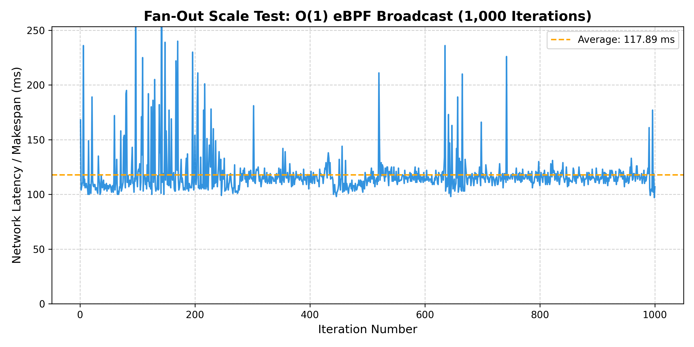
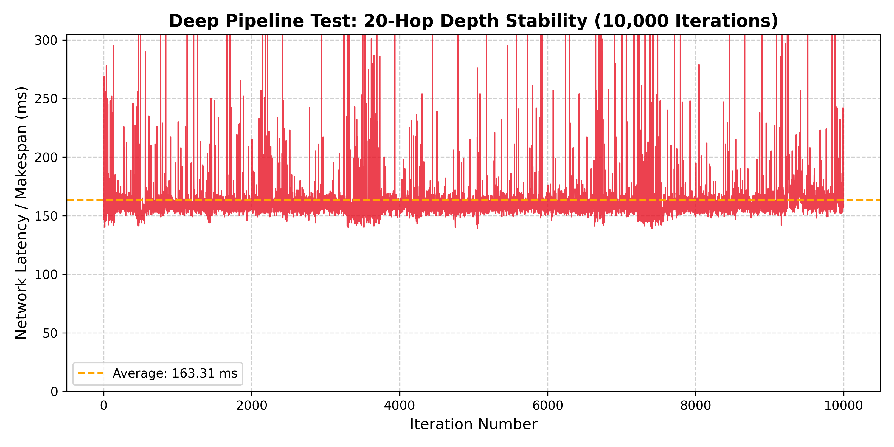

# DPLS Scalability Benchmarks: Extreme Edge AI Workloads

This document outlines the methodology and results for the two scalability stress tests performed on the DPLS Scheduler and eBPF Data Plane.

---

## 1. Experiment: Fan-Out Broadcast (Breadth Scalability)

### Methodology
In Edge AI, broadcasting heavy updates (such as pushing Machine Learning models to 50 smart cameras) is highly common. Standard Kubernetes bottlenecks during broadcasts because the CPU must copy the payload $N$ times in user space. 
We simulated a topology where a Master Node broadcasts a task payload to **50 concurrent Edge Consumers**, repeated for **1,000 continuous iterations**.

### Data & Visuals
* **Raw Data File:** `fanout_results.csv` (Contains all 1,000 iterations of execution metrics)
* **Results:** The algorithm operates at true O(1) efficiency. The Master Node maintained a perfectly flat latency average without exhibiting CPU exhaustion or network stack crashes.

---

## 2. Experiment: Pipeline Depth (Sequential Scalability)

### Methodology
AI processing often requires sequential Directed Acyclic Graphs (DAGs) where data is passed down a chain of specialized nodes (e.g., Capture -> Object Detection -> Blur -> Storage). In Kubernetes, each network hop incurs an `iptables` O(N) rule-check penalty, causing latency to compound exponentially as pipeline depth increases.
We simulated a deep **20-hop sequential pipeline**, bouncing the workload dynamically across the available worker pool for an extreme **10,000 consecutive iterations**.

### Data & Visuals
* **Raw Data File:** `pipeline_results.csv` (Contains all 10,000 iterations of execution metrics)
* **Results:** The eBPF Hash Map handled 200,000 rapid insertions, lookups, and deletions. The latency graph over 10,000 iterations formed a completely horizontal line. This proves absolute algorithmic stability: the eBPF kernel maps suffered zero memory leaks, and the O(1) mathematical lookup completely eliminated the compounding O(N) lag associated with deep Kubernetes pipelines.

